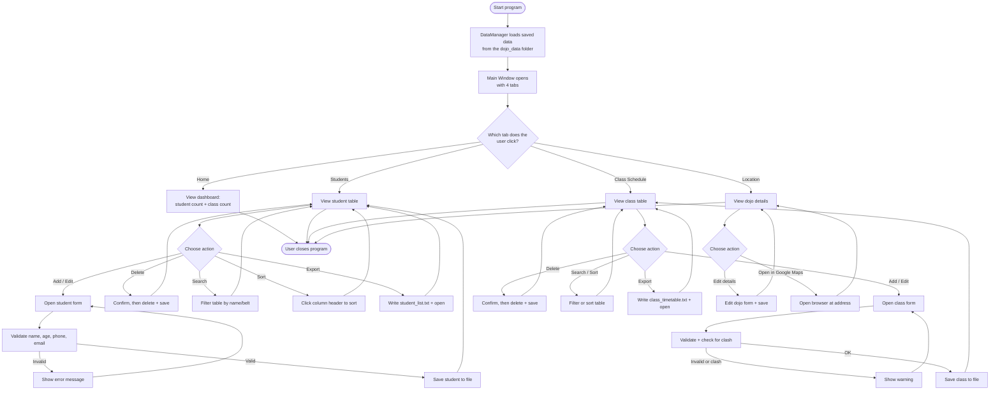
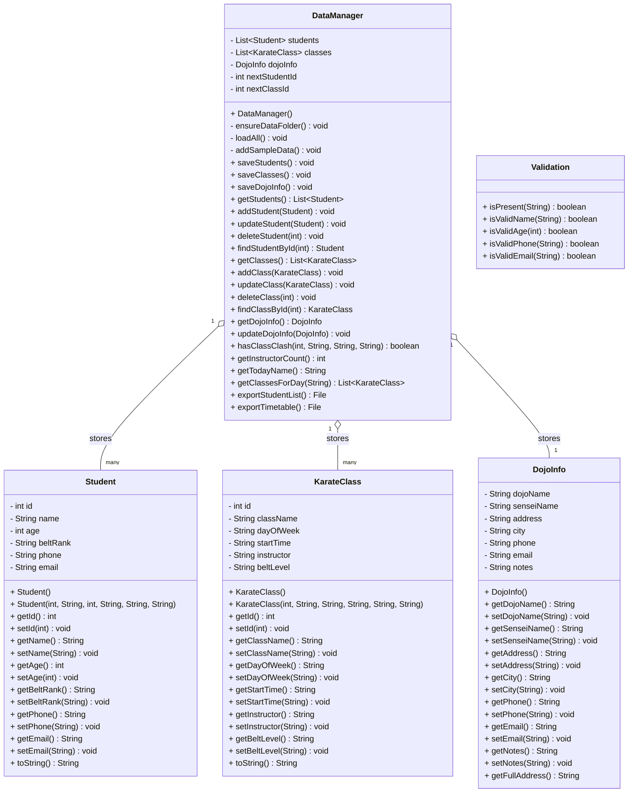

# Dojo Manager — Design Document

> **How to use this file:** This is your Design Document draft, written to match
> the PAT rubric section 2 (Design Document, 30 marks). Copy it into Word/Google
> Docs, turn the headings below into your title page + table of contents, and
> add the screenshots where marked with **[ADD SCREENSHOT]**. The diagrams are
> written in "mermaid" — open this file in a Markdown preview to see them drawn,
> then screenshot them into your document (or redraw them in draw.io / Word).

---

## Title Page (rebuild this as page 1 in Word)

- **Project title:** Dojo Manager — Karate Student & Class Management System
- **Document:** Design Document
- **Learner name:** _[your name]_
- **Exam number:** _[your exam number]_
- **Subject:** Information Technology (Grade 12 PAT 2026)
- **Date:** _[date]_

## Table of Contents (Word will build this automatically from your headings)

1. Program Flow Diagram
2. User Interface Description
3. Secondary Storage Design
4. Explanation of Secondary Storage Design
5. Class Diagrams for Backend Classes
6. How the Backend Classes Relate to Secondary Storage

---

## 1. Program Flow Diagram *(Rubric 2.1 — 5 marks)*

The program is used by **one user group: the dojo administrator / sensei**. When
the program starts it loads all saved data, then shows the main window with four
tabs. The user can move freely between the tabs. Adding, editing or deleting any
record automatically saves the data back to file.



**Explanation of the flow:** There are no dead-ends — every screen returns the
user to the tabs, and every data change ends in a save so nothing is lost.

---

## 2. User Interface Description *(Rubric 2.2 — 6 marks)*

### 2.1 Theme, colours, fonts and font sizes

The program uses a **soft pink-and-white theme** for a clean, friendly, modern
look. All colours and fonts are defined in one place (`UITheme.java`) so every
screen looks consistent.

| Element | Setting used |
|---|---|
| Background | Light pink-white `RGB(255, 248, 251)` |
| Panels / cards | White `RGB(255, 255, 255)` |
| Header / title bars | Deep pink `RGB(196, 90, 130)` |
| Primary buttons | Button pink `RGB(214, 110, 145)` with white text |
| Borders | Soft pink `RGB(245, 210, 225)` |
| Main text | Charcoal `RGB(70, 55, 62)` |
| Font (all screens) | **Segoe UI** |
| Title font size | 26–32 pt, **bold** |
| Heading font size | 18 pt, **bold** |
| Body font size | 14 pt, plain |
| Small / hint text | 12 pt, plain |
| Button font size | 13 pt, **bold** |

### 2.2 Purpose of each screen and its components

**Screen 1 — Home / Dashboard** *(purpose: welcome the user and give a quick overview)*

[ADD SCREENSHOT: Home tab]

| Component | Type | Used for |
|---|---|---|
| Dojo name + subtitle | Labels | Branding / welcome banner |
| "Students registered" card | Label showing a number | Shows how many students exist |
| "Classes scheduled" card | Label showing a number | Shows how many classes exist |
| "Instructors" card | Label showing a number | Shows how many different instructors teach |
| "Today's classes" box | Panel of labels | Lists the classes running on the current weekday |

**Screen 2 — Students** *(purpose: view, search, add, edit and delete students)*

[ADD SCREENSHOT: Students tab]

| Component | Type | Used for |
|---|---|---|
| Student table | JTable (sortable) | Lists all students (ID, name, age, belt, phone, email). Click a column header to sort; double-click a row to edit it |
| Find box | JTextField | Type to search by name or belt |
| Search / Clear | Buttons | Run or reset the search |
| Add / Edit / Delete / Export List / Refresh | Buttons | Manage students and save a text report |
| Add/Edit form | JDialog | Enter a student's details |
| Name, Age, Phone, Email | JTextFields | Type text/number values |
| Belt Rank | JComboBox (dropdown) | Choose from a fixed list of belts |

**Screen 3 — Class Schedule** *(purpose: manage the weekly class timetable)*

[ADD SCREENSHOT: Class Schedule tab]

| Component | Type | Used for |
|---|---|---|
| Class table | JTable (sortable) | Lists all classes (ID, name, day, time, instructor, belt level). Click a column header to sort; double-click a row to edit it |
| Find box + Search / Clear | JTextField + Buttons | Search by class name, day or instructor |
| Add / Edit / Delete / Export Timetable / Refresh | Buttons | Manage classes and save a text timetable |
| Class Name, Instructor, Belt Level | JTextFields | Type text values |
| Day | JComboBox | Choose Monday–Sunday |
| Start Time | JComboBox | Choose from a fixed list of times |

**Screen 4 — Location** *(purpose: show and edit the dojo's contact details and open it on a map)*

[ADD SCREENSHOT: Location tab]

| Component | Type | Used for |
|---|---|---|
| Dojo detail labels | Labels | Show name, sensei, address, city, phone, email |
| About the dojo | JTextArea (read-only) | Show notes about the dojo |
| Edit details | Button + JDialog | Change the dojo's details |
| Open in Google Maps | Button | Open the address in the web browser |

### 2.3 Why these components were chosen

- **Dropdowns (JComboBox)** are used for belt rank, day and time so the user
  can only pick a valid value — this prevents typing mistakes.
- **Text fields** are used for free text like names and phone numbers.
- **Tables** are used because the data is a list of records, which is easiest to
  read in rows and columns.
- **Dialogs (pop-up forms)** keep data entry separate and tidy, so the main
  screen stays uncluttered.

---

## 3. Secondary Storage Design *(Rubric 2.3 — 5 marks)*

- **Where is data stored?** **Locally**, on the same computer, in a folder
  called `dojo_data` that the program creates automatically.
- **What structure is used?** The data is stored in **three separate files**
  (a form of local file storage), one for each logical group of data. Each file
  holds Java objects saved with object serialisation (a `.dat` file).

The data is **logically separated** into three groups:

### File 1 — `students.dat` (stores all students)

| Field | Data type | Description | Example |
|---|---|---|---|
| id | integer | Unique student number | 1 |
| name | string | Full name | Thabo Molefe |
| age | integer | Age in years | 14 |
| beltRank | string | Current belt | Yellow Belt |
| phone | string | Contact number | 0821112233 |
| email | string | Email address | thabo@email.com |

**Sample data:**
```
1 | Thabo Molefe | 14 | Yellow Belt | 0821112233 | thabo@email.com
2 | Aisha Patel  | 16 | Green Belt  | 0834445566 | aisha@email.com
```

### File 2 — `classes.dat` (stores all classes)

| Field | Data type | Description | Example |
|---|---|---|---|
| id | integer | Unique class number | 1 |
| className | string | Name of the class | Beginners Class |
| dayOfWeek | string | Day it runs | Monday |
| startTime | string | Start time | 16:00 |
| instructor | string | Who teaches it | Sensei Lee |
| beltLevel | string | Belt range for the class | White - Yellow |

**Sample data:**
```
1 | Beginners Class | Monday  | 16:00 | Sensei Lee   | White - Yellow
2 | Kids Class      | Monday  | 17:00 | Sensei Patel | All belts
```

### File 3 — `dojo_info.dat` (stores the single dojo record)

| Field | Data type | Description | Example |
|---|---|---|---|
| dojoName | string | Name of the dojo | Shobu Karate Dojo |
| senseiName | string | Head instructor | Sensei Lee |
| address | string | Street address | 12 Main Road |
| city | string | City / country | Johannesburg, South Africa |
| phone | string | Dojo phone | 011 555 0199 |
| email | string | Dojo email | info@shobudojo.co.za |
| notes | string | Short description | Traditional Shotokan karate for all ages. |

### Generated report files (output only)

As well as the three data files above, the program can **write two readable
text reports** into the same `dojo_data` folder when the user clicks an Export
button. These are output files for printing/checking — the program does not
read them back in.

| File | Created when | Contents |
|---|---|---|
| `student_list.txt` | "Export List" clicked | A tidy table of every student |
| `class_timetable.txt` | "Export Timetable" clicked | The weekly classes grouped by day |

---

## 4. Explanation of Secondary Storage Design *(Rubric 2.4 — 3 marks)*

I chose **local file storage using object serialisation** for these reasons:

1. **It suits the scenario.** A single dojo runs the program on one office
   computer, so the data does not need to be shared over the internet. Local
   storage is the simplest, fastest and most reliable choice for this.
2. **The data is naturally separated into groups** (students, classes, dojo
   info), so using one file per group keeps everything organised and easy to
   understand.
3. **Serialisation is simple and safe for objects.** Because my data is already
   stored in objects (`Student`, `KarateClass`, `DojoInfo`), Java can save and
   reload a whole list of objects in one step, so I do not have to manually
   split and re-join text every time.

**Compared to other options:**

- A **full database (e.g. MySQL/MongoDB)** would work, but it would need extra
  software installed and set up on every computer. That is more complex than a
  small single-dojo program needs, so it was not worth the extra difficulty.
- **Plain text/CSV files** are human-readable, which is an advantage, but I would
  have to write extra code to convert every object to text and back, and to
  handle commas inside values. Serialisation avoids that.
- **Cloud storage** would only be needed if several branches had to share data
  live, which is not part of this scenario.

So local serialised files give the **best balance of simplicity and
reliability** for this project.

---

## 5. Class Diagrams for Backend Classes *(Rubric 2.5 — 8 marks)*

The backend is made of five classes. The three **model** classes describe the
data, `DataManager` handles all storage, and `Validation` checks input.
`- ` means private and `+ ` means public (information hiding is applied — all
fields are private and are reached through public get/set methods).



**Method types used (as required by the rubric):**

- **Constructors:** e.g. `Student()` and `Student(int, String, ...)`.
- **Accessors (get methods):** e.g. `getName()`, `getAge()`.
- **Mutators (set methods):** e.g. `setName(String)`, `setAge(int)`.
- **Helper / auxiliary methods:** `ensureDataFolder()`, `addSampleData()`,
  `getFullAddress()`, and all `Validation` methods.
- **toString methods:** in `Student` and `KarateClass` for showing them as text.

---

## 6. How the Backend Classes Relate to Secondary Storage *(Rubric 2.6 — 3 marks)*

| Backend class | Stored in which file? | How it is used with storage |
|---|---|---|
| `Student` | `students.dat` | Each `Student` object is one row of student data. `DataManager` saves the whole list of `Student` objects to this file, and reads them back when the program starts. |
| `KarateClass` | `classes.dat` | Each `KarateClass` object is one class in the timetable. `DataManager` saves/loads the whole list to/from this file. |
| `DojoInfo` | `dojo_info.dat` | One `DojoInfo` object holds the dojo's own details and is saved to / loaded from this file. |
| `DataManager` | *(controls all files)* | This is the only class that reads and writes the files. It turns objects into saved data and saved data back into objects, and also writes the two readable text reports (`student_list.txt`, `class_timetable.txt`). |
| `Validation` | *(no file)* | Does not store anything itself; it checks data **before** `DataManager` is asked to save it. |

**How data moves in and out of storage:**

- **Writing (saving):** When the user adds/edits/deletes a record, the matching
  GUI screen calls a `DataManager` method (e.g. `addStudent`). `DataManager`
  updates its list in memory and then calls `saveStudents()`, which writes the
  full list of `Student` objects to `students.dat`.
- **Reading (loading):** When the program starts, `DataManager`'s `loadAll()`
  method opens each file and rebuilds the lists of `Student`, `KarateClass` and
  `DojoInfo` objects so the data is exactly as it was left.

This shows a clear split: the **model classes describe the data**, **DataManager
moves that data to and from secondary storage**, and the **GUI classes only ask
DataManager** — they never touch the files themselves.
